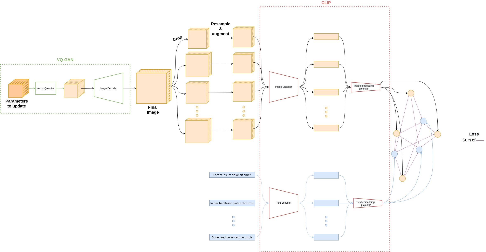

# Image generation with CLIP and VQ-GAN

This repository provides a script to generate an image from a text.

## Principle

The generation of the image from a text is based on the use of 2 trained models:
- VQ-GAN: It is a generative model whose decoder part allows to generate an image;
- CLIP: This is a model that allows images and texts to be compared by projecting them into the same space. The closer their embeddings in the projection space, the more similar they are.

How does the generation work?

The idea here is to optimise the representation of the image in the latent space of the VQ-GAN (dark orange block at the top left of the figure) so that the orange points are as close as possible to the blue points. Therefore, when optimising, the values that will change are those shown in orange in the figure.




## Details
Many very good implementations have already been proposed by many people. I took most of the code in `image_generator_torch.py` using the pytorch framework from a notebook made by - to the best of my knowledge - Katherine Crowson (https://github.com/crowsonkb, https://twitter.com/RiversHaveWings); https://twitter.com/advadnoun; Eleiber#8347 and Abulafia#3734. 

This repository proposes a brand new implementation in jax in `image_generator.py`. 
## Usage

After installing the dependencies, you can test to generate an image with the following command:

```sh
python image_generator.py --texts_prompts ['superrealistic house in forest']
```

and you can see all the possible options by doing:

```sh
python image_generator.py --help
```

